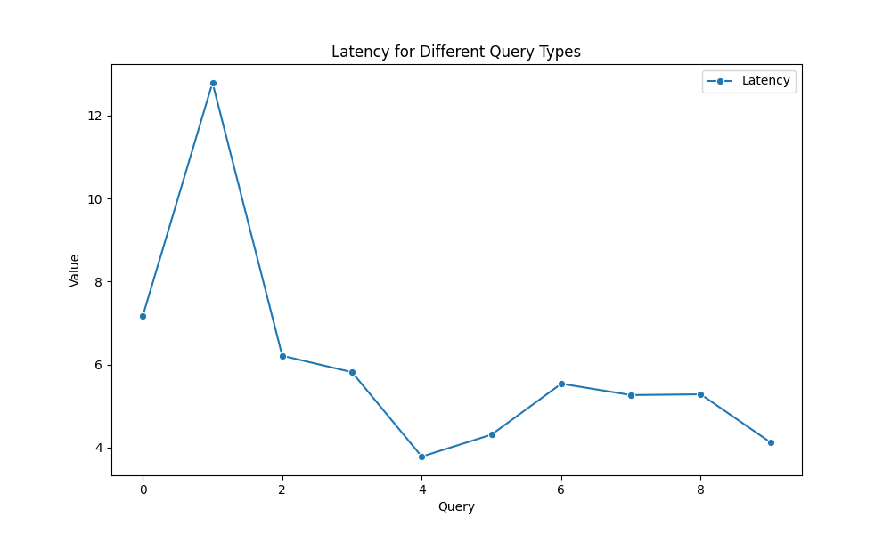
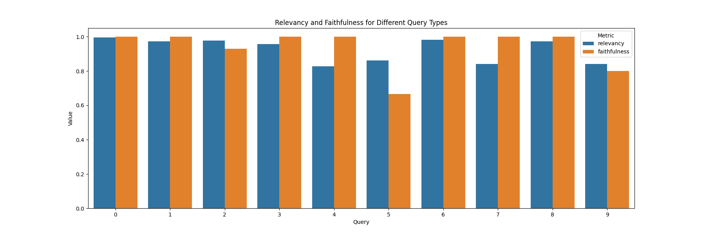
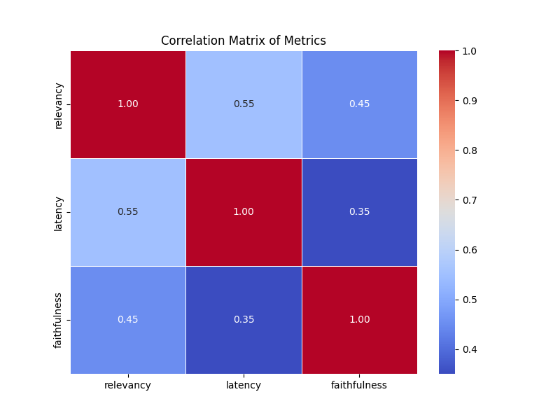

# GraphRAG-Evaluation

This repository contains methodologies to evaluate a Retrieval-Augmented Generation (RAG) Model, specifically focusing on the integration of Neo4j graph databases and vector searches. The codebase evaluates the [MovieMatch RAG Application](https://github.com/abhi7991/RAGApplication). The evaluation framework provided here helps in assessing the performance and effectiveness of RAG models in generating accurate and relevant answers by utilizing retrieved contexts. The following metrics offer comprehensive insights into various aspects of the model's performance, from precision and recall to relevancy and latency.

For this particular analysis I have taken 3 distinct metrics.

## [Overview](Evaluation_Report.pdf)

## [Detailed Code](Evaluating_MovieMatch.ipynb)

### Answer Metrics
- **Answer Relevancy**: Evaluates the relevance of the generated answers to the query.
- **Faithfulness**: Measures the accuracy of the generated answers in relation to the retrieved contexts.

### Performance Metrics
- **Latency**: Measures the response time of the model from input to output.


## Evaluation Framework: Ragas

[Ragas](https://docs.ragas.io/en/stable/index.html) is a framework that helps you evaluate your Retrieval-Augmented Generation (RAG) pipelines. RAG denotes a class of LLM applications that use external data to augment the LLM’s context. There are existing tools and frameworks that help you build these pipelines, but evaluating and quantifying your pipeline performance can be challenging. This is where Ragas (RAG Assessment) comes in.

Ragas provides a structured approach to evaluating RAG models by offering a variety of metrics that assess different aspects of the model’s performance. By using Ragas, you can gain a detailed understanding of how well your RAG pipeline is performing and identify areas for improvement.


Below is an example of how to use Ragas to evaluate your RAG model:

```python
from datasets import Dataset
from ragas import evaluate
from ragas.run_config import RunConfig
from ragas.metrics import (
    answer_relevancy,
    faithfulness,
    latency,
)

llm = ChatOpenAI(
    model_name="gpt-4o",
    temperature=0,
    streaming=True,
    max_tokens=1000,
)

eval_dict = {"question": [], "contexts": [], "ground_truth": [], "answer": []}
 
for row, context, answer in zip(
    dataset,  # this is your initial dataset with questions and ground truths
    retrieved_contexts,
    answers,
):
    question = row["question"]
    ground_truth = row["ground_truth"]
    eval_dict["question"].append(question)
    eval_dict["contexts"].append(context)
    eval_dict["ground_truth"].append(ground_truth)
    eval_dict["answer"].append(answer)

dataset = Dataset.from_dict(eval_dict)

score = evaluate(
    dataset,
    metrics=[
        answer_relevancy,
        faithfulness,
        latency,
    ],
    llm=llm,
    run_config=RunConfig(max_retries=2)
)
print(score)

```

## Visualisation



